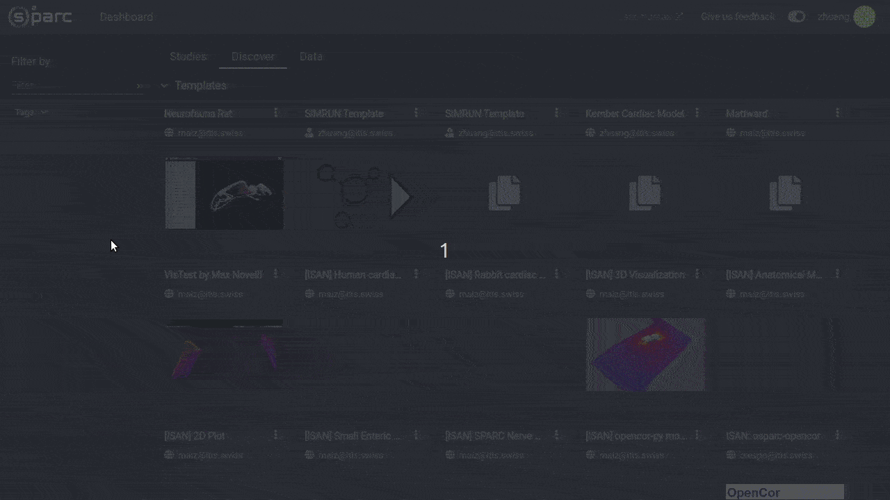

# Discover Tab

The **Discover** Tab contains published studies and services available to you. 

## Templates
The top section, **Templates** refers to studies that you may reuse in your own work. Clicking on a template will create a copy of that study, which will appear in your own **Studies** tab with the same name as the template. Any changes you make to this copy will not affect the original template. This is extremely useful, for example, if your team uses the same analysis pipeline but you may want to change an input file. 

Any changes you make to the resulting copy will not affect the template which you have copied from. If you choose to create a template from a study you have created, it will also appear here in the **Discover** tab of the **Dashboard**.

## Services
This section functions very similarly to template studies. Clicking on a published service will create a study in your **Studies** tab with the single service inside the study. 
