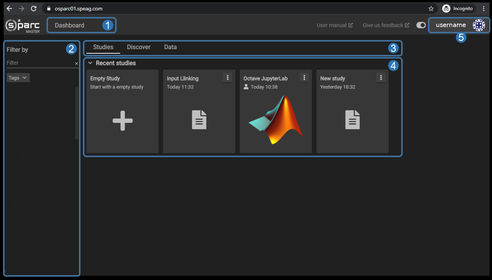

# Dashboard 

The Dashboard is your hub which contains studies you have created as well as studies that have been shared with you. From the Dashboard you are able to open your projects and studies in the **Workbench** or create a new studies from scratch.


*Main sections and elements of the *o²S²PARC* Dashboard.*

Within the Dashboard a number of important sections and elements can be are highlighted:

1. **Dashboard Button** <br/>
   This button allows you to return to the Dashboard and Overview at any time from anywhere within the platform.

2. **Study Filter and Search** <br/>
   This tool allows you to filter studies, templates, and services (either your own or submitted by others) on the **Studies** and **Discover** tabs. You can filter by:
      * string, name
      * keywords
      * [tags](/docs/platform_introduction/main_window_and_navigation/user_setup/profile.md)
      * classifiers

   The filtered items are then either highlighted in the flowchart, shown/hidden within services catalogues, etc. 

3. **Dashboard Menu** <br/>
   The menu tabs give you quick access to a set of core elements of the platform, namely the Studies, the Services and the [Data](/docs/platform_introduction/core_elements/Data.md).

4. **Recent Studies** <br/>
   In this section you'll find your personal studies or studies that have been shared with you. Clicking (single click) on one of these studies will show more details, double clicking will get you into the study itself.<br/>

   Clicking on the (+) ```Empty Study``` button allows you to set up a new study (pipeline) from scratch.

5. **Account Details** <br/>
    In the account details you'll find the preferences for your account as well as information about the software version. In addition you may log out on this menu.

