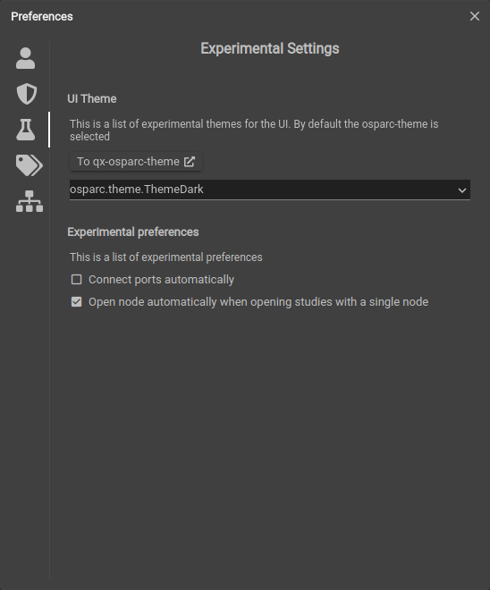

# Profile

In the right top corner (clicking on the user icon/avatar), the user and platform preferences are available.

Clicking on the icon provides:

* the user preferences dialog
* a link to the user manual
* information about the current platform and versions of essential parts
* logout from the platform


## Preferences
Entering the preferences dialog, a separate window pops up which allows the user to define and modify settings and preferences as follows:

* __User Profile__ <br/>
  Information like name and profile picture - the picture is based on your [gravatar](https://en.gravatar.com/).

* __Security Settings__ <br/>
  Here the user can change the password. Moreover (and quite important), in this dialog the user can specify access tokens for the DAT-Core/Blackfynn platform - for automated access of files (storage, retrieval) on Blackfynn.

* __Additional (and Experimental) Settings__ <br/>
  Here, e.g., the UI Theme can be set (light vs dark) and input/output ports can be set to map automatically. More details about this feature can be found [here](docs/study_setup/connecting_services?id=auto-connect-option).

   <br/>

* __Tags__ <br/>
  Here you may define custom tags, or labels, for your studies, that are only visible to you. Tagging a study and then sharing it does provide the same tag for those you have shared it with. Once you have created the tags, you may assign them by editing the metadata of a study. To do this, follow the steps below:
  1. Navigate to the **Studies** tab of the **Dashboard**
  2. Choose the study options (3-dot button) on the study you would like to assign a tag to
  3. choose **More Info** option
  4. Click ```Edit``` on the bottom left corner of the popup
  5. Click ```Tags``` on the bottom left corner of the popup
  6. In the second popup, choose one or more tags you have defined and close this popup.
  7. Click ```Save``` to save the updated metadata of your study.

   <br/>

