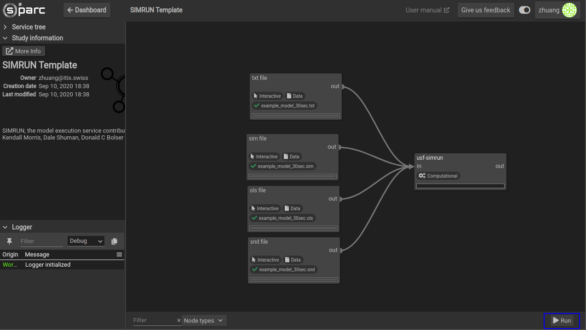

# Running a Pipeline

For your custom models and basic computations, running a study is straightforward. Once you have your pipelin connected, click the __Run__ button on the bottom right hand side of the screen. Please note that this will not run code that is written inside Jupyter Notebooks inside Jupyter Notebook services or JupyterLab services. Running a pipeline will execute only "computational" services (e.g. services where parameters are set before running such as the [Cardiac Tissue Models](docs/isan_studies___tutorials/uc_davies.md)). 


*The* ```Run``` *Button is located at the bottom right corner of your **Study Workbench**, highlighted with blue in this image.*


To see run progress, you may expand the Logger subwindow of the **Study Workbench** where you will see messages about the status of the run. 


