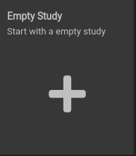

# Create a Study

## Study From Scratch
You may choose to create a Study (*o²S²PARC* project) from scratch or based on an existing Template. To create an empty Study with no Services inside, navigate to the **Studies** tab of the **Dashboard** and click on the ```Empty Study``` button, which will take you directly to the **Study Workspace** of your new Study.



## Study From Template

You may also create the Study from an existing Template, navigate to the **Templates** tab of the **Dashboard** and click on an existing card. This will create a copy of the Template Study which will from this point on, be accessible from the **Studies** tab of the **Dashboard**. This Study will be private unless you decide to share it an any changes you make to the resulting Study will not affect the Template you have copied from. 


## Copying a Study
You may choose to create a Study from an existing one by creating a copy of it. To create a copy of a Study go to the **Studies** tab of the **Dashboard**, click on the ```More options``` (3-dots) button on the Study card and select ```Duplicate```.

If the study is small (it contains few MB of data) the copy will take few seconds, while it might take longer for larger Studies. In those cases, you will be informed about the progress (see animation below). The copying process works similar to [Publishing a Study as a Template](../study_setup/sharestudy.md#publishing-a-study-as-a-template)


**Note**: copying is limited to Studies that are smaller than 100 GiB will, please [**contact us**](../support/support) if you cannot reduce the size and you need to copy a large Study. 
