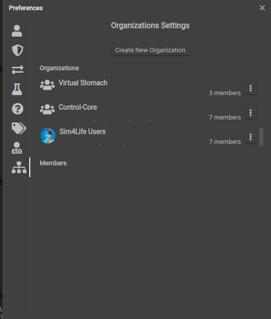

# Sharing and Publishing Studies

There are two ways in which your work on the online platform can be accessed by others. You may either share an instance of your Study with other member(s) of an organization, or  publish the Study as a Template for other members to copy. 

For a full demonstration of these functionalities, take a look at our webinar on collaboration!

<p align="center">
<iframe width="784" height="441" src="https://www.youtube.com/embed/cI5p0bki258" frameborder="0" allow="accelerometer; autoplay; encrypted-media; gyroscope; picture-in-picture" allowfullscreen></iframe>
</p>

## Organization
An organization is any group of o²S²PARC users that are able to share Studies with each other. To see which organizations you are a part of, go to your user preferences through your [Profile](docs/platform_introduction//user_setup/profile) button on the top right corner of the user interface. Then choose the organization icon (the last icon) which will display all organizations you belong to and you may see the members of each organization by clicking on it. The member details will be then displayed in the lower half of the window under ```Members```. There are three different types of members in an organization:
1. **Regular Member**
    * Has access to shared content of the organization
    * Can share content with the organization
2. **Manager**
    * Has Member privileges
    * Can add or remove Members
    * Can promote Members to Managers
3. **Administrator**
    * Has Manager privileges
    * Can edit the organization’s description
    * Can delete the organization

To create a new organization, click the ```Create New Organization``` button and add members by entering each new member's o²S²PARC email address and then clicking ```Invite```. Note that you may only add members that are already registered o²S²PARC users. If a user is successfully added, you will see a confirmation message and if there was an error, e.g. the email address is not registered, you will see an error message pop up. You may then change each member's privileges by clicking on that member's name. 



## Sharing a Study
Sharing a Study instance with other users allows collaboration on the same pipeline and code. When one member of the shared users is editing a Study, the Study is locked for the others. When that user finishes and returns to their Dashboard, the changes will be updated when another member accesses the Study. 


To share a Study:
1. Access the Study's options from the **Dashboard** by clicking on the three dot button on the upper right hand corner of the Study's card. 
2. Choose the ```More options``` option. A modal should appear.
3. In the popup modal, there is a panel menu to the left. Click on the ```Sharing``` button (second button from the top)  to switch to the Sharing tab.
4. In the Sharing tab, click on the ```Organizations and Members``` dropdown to see the list of users you may share with. Choose one or more people/organizations to share your Study with, and then click the ```Add``` button.
5. The Study will then appear in the **Studies** tab of the user(s) you have shared with. 

## Publishing a Study as a Template
Publishing a Study as a Template will save the state of the Study at the current moment and it will appear as a *Template Study* in the **Templates** tab of the **Dashboard**. Any changes made to the original Study after publishing as a Template will not change the Template. Clicking on the Template Study in the **Templates** tab will create a copy of the contents of the Template accessible in your **Studies** tab. Any changes you make to this new Study will not affect the original Template. 

To publish your Study as a Template:
1. Access the Study's options from the **Dashboard** by clicking on the three dot button on the upper right hand corner of the Study's card. 
2. Choose the ```More options``` option. A modal should appear.
3. In the popup modal, there is a panel menu to the left. Click on the ```Save as Template``` button (bottom-most button)  to switch to the Templating tab.
4. Set the access rights of the Template in the popup menu. You may make the Template accessible to only yourself or members of organizations. If you choose **Organizations**, you will be able to select from the list of organizations that you are a part of. 


5. You may also choose to publish the Template with the data inside (for example, if you have any files saved in a JupyterLab inside the Study). To publish with data, scroll down in the modal and make sure the "Publish with data" field is checked. To export the pipeline structure without any customizations, uncheck the box.
6. Click the ```Publish``` button on the bottom right hand corner.
7. The Template will now appear as a **Template Study** in your **Templates** tab. If you have chosen to share the Template with members of an organization, others in that same organization will also see the Study in their respective **Templates** tabs.


