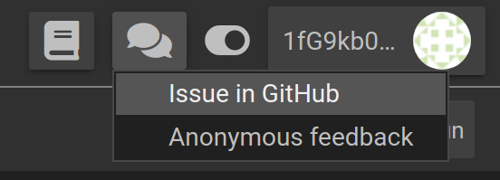

# Help & Support

Getting started with modeling and simulation can be a challenging task. We will try our best to guide you along the way. In case our user manual and the tutorial examples could not answer your question, take a look at the following resources:

## Contact Support and Submitting Feedback

Since modeling and simulation is is a domain that sometimes requires quite a bit of experience, we aim to provide the best support possible to all of our users.

Currently we offer support by options to contact our team via [email](mailto:support@osparc.io) or to open a support ticket from within the [platform](https://osparc.io) directly generating an issue in Github, which will then flow into our backlog. Submitting a Github issue is accessible through the ```Give us feedback``` button with a chat icon on the top right of each *osparc* page and then choose the *Issue in GitHub* option. 
Please note that Github reporting requires a [Github](https://github.com/) account.

 <br/>

Users can also directly leave feedback to us via a Google Form. This can be also accessed via the ```Give us feedback``` button with a chat icon and choosing the *Anonymous feedback* option, Which will then open an *osparc* Platform Feedback form.


